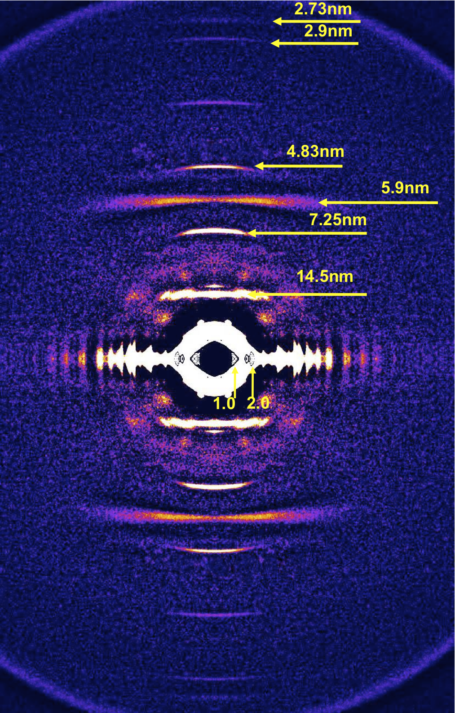

muscle_saxs
===========

Background subtraction and peak recognition for x-ray diffraction images of muscle

## A short introduction to diffraction peaks and their related structures

X-ray diffraction produces many peaks, each corresponding to a particular length of repeating structure in a particular orientation. This is an attempt to offer a brief guide to x-ray diffraction parameters.

X-ray peaks are frequently split into two general lines or areas, the equator and the meridian. The equator typically shows the strongest patterns and is the result of features which are orthogonal to the long axis of the thick and thin filaments (hereafter the radial direction). The meridian is perpendicular to the equator and has patterns which are the result of repeating structures along the long axis of the thick and thin filaments (hereafter the axial direction). Let's look at some specific diffraction peaks in each instance and talk about what gives rise to them:

### Equatorial direction 

Equatorial diffraction lines arise from structures in the radial or transverse direction (that direction which is orthogonal to the long axes of the thick and thin filaments and the direction in which they slide past each other). This is the direction in which lattice spacing changes and in which myosin must diffuse in order to bind to actin and generate force. Some of the diffraction peaks are: 

* 1.0 diffraction line - from the spacing between two adjacent layers of thick filaments 
* 1.1 diffraction line - from the spacing between an actin layer and its adjacent myosin layer
* 2.0 diffraction line - from the spacing between an actin layer and its adjacent myosin layer

These are only rough guides, a more in depth discussion of these peaks and their corresponding structures can be found in Irving (2006) and Squire (1982) and will benefit from a refresher course on crystal structure.

### Meridional direction 

Meridional diffraction lines arise from repeating structures aligned with the long axis of the thick and thin filaments. These lines are typically farther out from the center of the image and are frequently cropped off when examining the equatorial patterns, but provide information about strain and twisting along the thick and thin filaments. Some of the lines are:

* 14.5nm - from the spacing between adjacent crowns of myosin (which emerges from the thick filament backbone in sets of two and three spaced around the long axis of the thick filament)
* 7.25nm - a higher order multiple of the 14.5nm line
* 5.9nm - from the actin helix when treated as a tightly-coiled single-start left-handed helix as opposed to as a double-start helix. This is the same as the difference between treating the f-actin chain as a more tightly coiled set of g-actin monomers versus as a more loosely coiled set of g-actin dimers. A

### Citations
TC Irving. *X-ray diffraction of indirect flight muscle from Drosophila in vivo.* in *Nature's Versatile Engine: Insect Flight Muscle Inside and Out.* JO Vigoreaux, editor. Landes Bioscience, Georgetown, TX (2006) pp. 197–213

JM Squire. *The structural basis of muscular contraction.* Plenum Press (1982)
